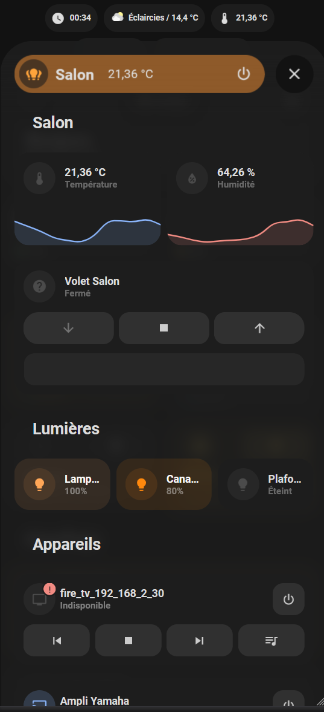

# Welcome !

This is my Home Assistant installation.

## Screenshots

     

## Some statistics about my installation:

Description | value
-- | --
Number of entities | 1134
Number of sensors | 600

## My installed extensions:

### Add-ons
- Advanced SSH & Web Terminal
- AirCast
- Barcode Buddy for Grocy
- CEC Scanner
- diyHue
- ESPHome
- Fusion
- Git pull
- Glances
- Grocy
- Home Assistant Google Drive Backup
- Log Viewer
- Mosquitto broker
- Node-RED
- openWakeWord
- Piper
- RPC Shutdown
- SQLite Web
- Studio Code Server
- TooGoodToGo Home Assistant MQTT Bridge
- Uptime Kuma
- Whisper
- Zigbee2MQTT

### Custom integrations
- [Adaptive Lighting](https://github.com/basnijholt/adaptive-lighting)
- [Alarmo](https://github.com/nielsfaber/alarmo)
- [Attributes Extractor](https://github.com/pilotak/homeassistant-attributes)
- [Better Thermostat](https://github.com/KartoffelToby/better_thermostat)
- [Browser Mod](https://github.com/thomasloven/hass-browser_mod)
- [Candy Simply Fi](https://github.com/ofalvai/home-assistant-candy)
- [Chroma](https://github.com/Vaskivskyi/ha-chroma)
- [Circadian Lighting](https://github.com/claytonjn/hass-circadian_lighting)
- [Expose Camera Stream Source](https://github.com/felipecrs/hass-expose-camera-stream-source)
- [Feedparser](https://github.com/custom-components/feedparser)
- [Generate Readme](https://github.com/custom-components/readme)
- [HACS](https://github.com/hacs/integration)
- [Hass.Agent](https://github.com/LAB02-Research/HASS.Agent-Integration)
- [Hass.Agent Notifier](https://github.com/LAB02-Research/HASS.Agent-Notifier)
- [Home Assistant Plant](https://github.com/Olen/homeassistant-plant)
- [Home Assistant Registry](https://github.com/amosyuen/ha-registry)
- [Inverse](https://github.com/disforw/inverse)
- [Measureit](https://github.com/danieldotnl/ha-measureit)
- [My Ecowatt By Rte](https://github.com/kamaradclimber/rte-ecowatt)
- [Node Red Companion](https://github.com/zachowj/hass-node-red)
- [Openplantbook](https://github.com/Olen/home-assistant-openplantbook)
- [Openrgb](https://github.com/koying/openrgb_ha)
- [Opnsense Integration For Home Assistant](https://github.com/travisghansen/hass-opnsense)
- [Places](https://github.com/custom-components/places)
- [Powercalc](https://github.com/bramstroker/homeassistant-powercalc)
- [Prix Carburant](https://github.com/Aohzan/hass-prixcarburant)
- [Qr Code Generator](https://github.com/DeerMaximum/QR-Code-Generator)
- [Retry](https://github.com/amitfin/retry)
- [Shopping List With Grocy](https://github.com/Anrolosia/Shopping-List-with-Grocy)
- [Spook 👻 Not Your Homie](https://github.com/frenck/spook)
- [Switch Manager](https://github.com/Sian-Lee-SA/Home-Assistant-Switch-Manager)
- [Thermal Comfort](https://github.com/dolezsa/thermal_comfort)
- [Ui Lovelace Minimalist](https://github.com/UI-Lovelace-Minimalist/UI)
- [Vigieau](https://github.com/kamaradclimber/vigieau)
- [Watchman](https://github.com/dummylabs/thewatchman)
- [Xiaomi Cloud Map Extractor](https://github.com/PiotrMachowski/Home-Assistant-custom-components-Xiaomi-Cloud-Map-Extractor)
- [⚡ Myenedis Sensor](https://github.com/saniho/apiEnedis)

### Lovelace plugins
- [Apexcharts Card](https://github.com/RomRider/apexcharts-card)
- [Auto Entities](https://github.com/thomasloven/lovelace-auto-entities)
- [Banner Card](https://github.com/nervetattoo/banner-card)
- [Bar Card](https://github.com/custom-cards/bar-card)
- [Battery State Card / Entity Row](https://github.com/maxwroc/battery-state-card)
- [Better Thermostat Ui](https://github.com/KartoffelToby/better-thermostat-ui-card)
- [Big Slider Card](https://github.com/nicufarmache/lovelace-big-slider-card)
- [Bootstrap Grid Card](https://github.com/ownbee/bootstrap-grid-card)
- [Bubble Card](https://github.com/Clooos/Bubble-Card)
- [Button Card](https://github.com/custom-cards/button-card)
- [Canary](https://github.com/jcwillox/lovelace-canary)
- [Card Mod](https://github.com/thomasloven/lovelace-card-mod)
- [Card Tools](https://github.com/thomasloven/lovelace-card-tools)
- [Collapsable Cards](https://github.com/RossMcMillan92/lovelace-collapsable-cards)
- [Energy Entity Row](https://github.com/zeronounours/lovelace-energy-entity-row)
- [Energy Period Selector Plus](https://github.com/flixlix/energy-period-selector-plus)
- [Fluid Level Background Card](https://github.com/swingerman/lovelace-fluid-level-background-card)
- [Fold Entity Row](https://github.com/thomasloven/lovelace-fold-entity-row)
- [Ha Floorplan 🖌🎨   Your Imagination Just Become The New Limit](https://github.com/ExperienceLovelace/ha-floorplan)
- [Hass Hue Icons](https://github.com/arallsopp/hass-hue-icons)
- [History Explorer Card](https://github.com/alexarch21/history-explorer-card)
- [Hourly Weather Card](https://github.com/decompil3d/lovelace-hourly-weather)
- [Layout Card](https://github.com/thomasloven/lovelace-layout-card)
- [Light Entity Card](https://github.com/ljmerza/light-entity-card)
- [Mini Graph Card](https://github.com/kalkih/mini-graph-card)
- [Mini Media Player](https://github.com/kalkih/mini-media-player)
- [Multiple Entity Row](https://github.com/benct/lovelace-multiple-entity-row)
- [Mushroom](https://github.com/piitaya/lovelace-mushroom)
- [My Cards Bundle](https://github.com/AnthonMS/my-cards)
- [Paper Buttons Row](https://github.com/jcwillox/lovelace-paper-buttons-row)
- [Plotly Graph Card](https://github.com/dbuezas/lovelace-plotly-graph-card)
- [Rain Gauge Card](https://github.com/t1gr0u/rain-gauge-card)
- [Rgb Light Card](https://github.com/bokub/rgb-light-card)
- [Room Card](https://github.com/marcokreeft87/room-card)
- [Shutter Card](https://github.com/Deejayfool/hass-shutter-card)
- [Simple Weather Card](https://github.com/kalkih/simple-weather-card)
- [Slider Entity Row](https://github.com/thomasloven/lovelace-slider-entity-row)
- [Stack In Card](https://github.com/custom-cards/stack-in-card)
- [State Switch](https://github.com/thomasloven/lovelace-state-switch)
- [Sun Card](https://github.com/AitorDB/home-assistant-sun-card)
- [Swipe Card](https://github.com/bramkragten/swipe-card)
- [Thermal Comfort Icons](https://github.com/rautesamtr/thermal_comfort_icons)
- [Timer Bar Card](https://github.com/rianadon/timer-bar-card)
- [Vacuum Card](https://github.com/denysdovhan/vacuum-card)
- [Vertical Stack In Card](https://github.com/ofekashery/vertical-stack-in-card)
- [Weather Card](https://github.com/bramkragten/weather-card)
- [Windrose Card](https://github.com/aukedejong/lovelace-windrose-card)
- [Xiaomi Vacuum Map Card](https://github.com/PiotrMachowski/lovelace-xiaomi-vacuum-map-card)

### Themes
- [Mushroom Themes](https://github.com/piitaya/lovelace-mushroom-themes)

***

Generated by the [custom readme integration](https://github.com/custom-components/readme)